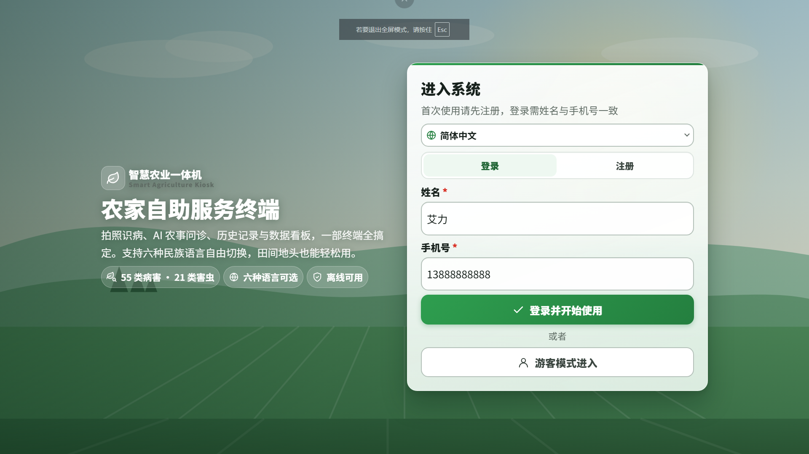
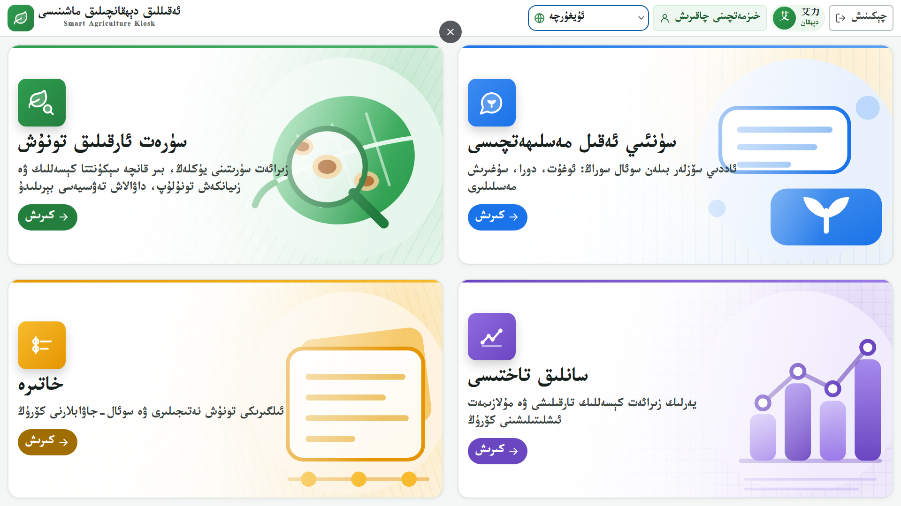
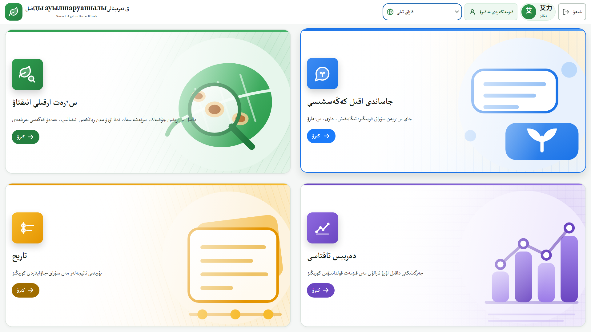
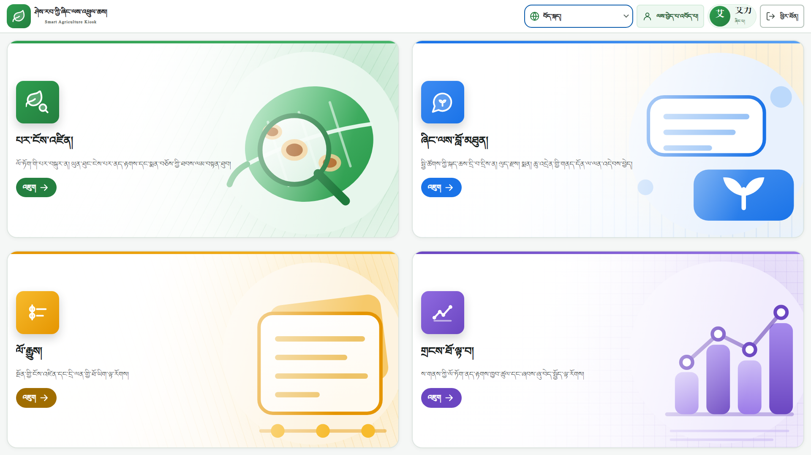
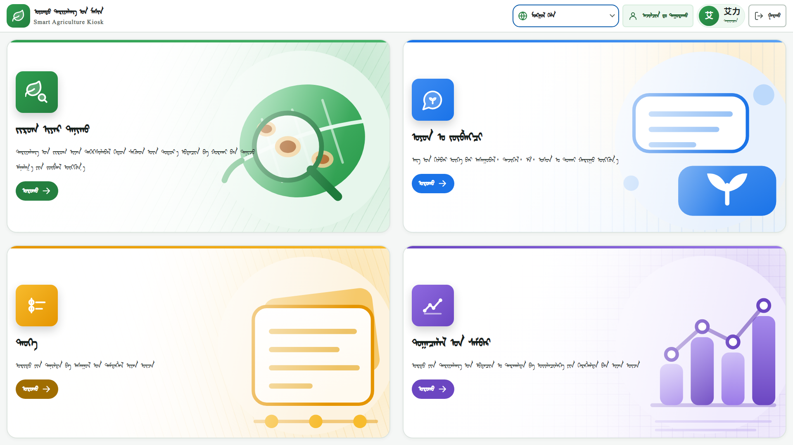
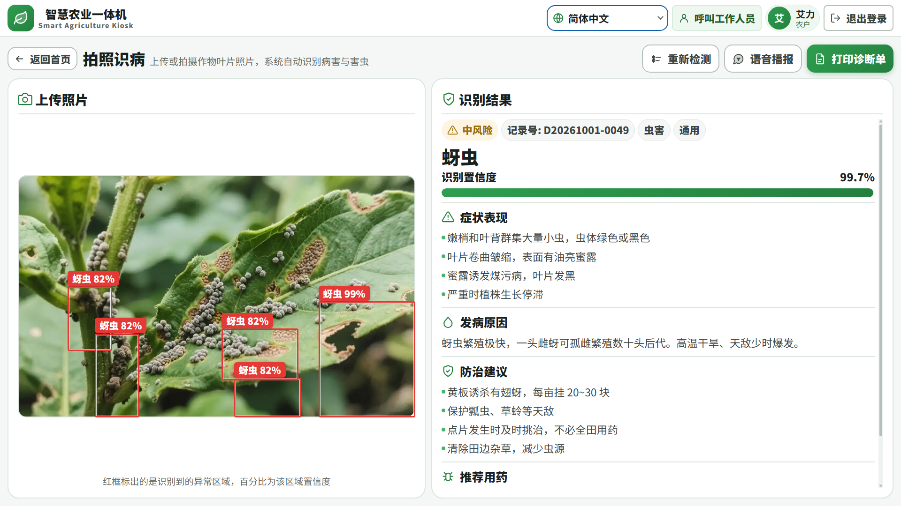
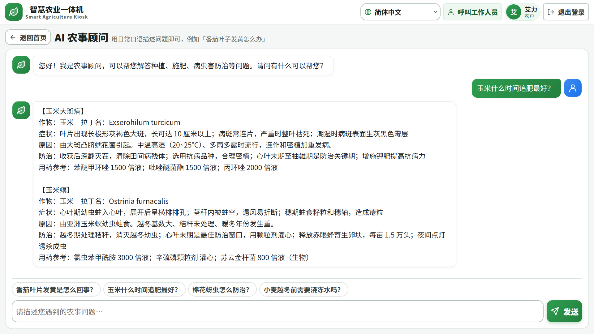
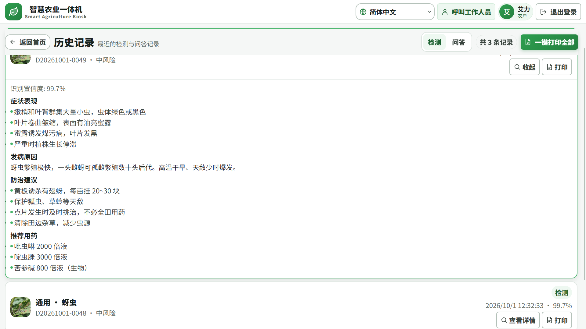
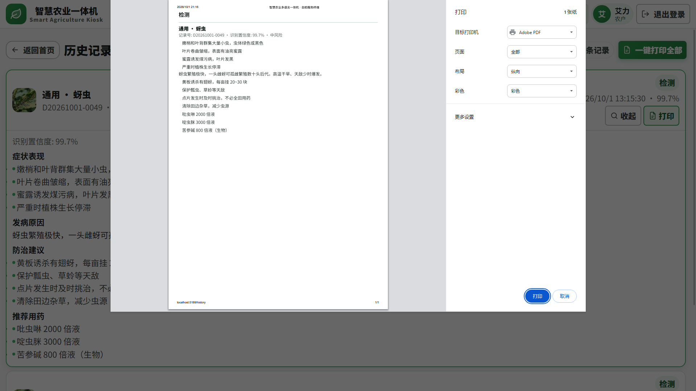
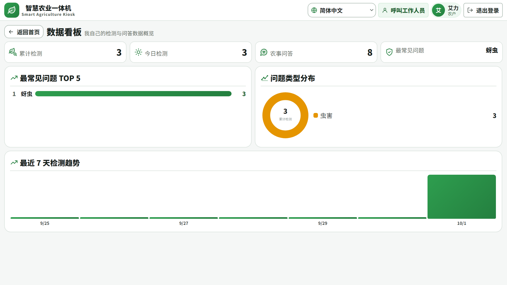

# 智慧农业多语言一体机服务系统

> 面向少数民族地区农业自助终端的多语言一体机 —— 拍照识病、AI 农事问答、历史记录、数据看板，配套 Web 管理后台。

## 一句话简介

农村老人和少数民族农户用手机 App 有门槛：看不懂、不会用、信号差。本项目把服务做成**村口的一台大屏自助机**：6 种语言自由切换、字号放大到 3 米外看得清、拍照放上病叶就能出防治方案、随时能一键呼叫工作人员。后台则给农技员用，负责用户、大模型配置、词条维护和运营看板。

## 界面预览

### 登录页

6 种语言可在此就地切换；登录 / 注册 / 游客三种入口并列，姓名 + 手机号是唯一身份凭据。



### 一体机主界面 · 多语言

四个功能入口铺满整屏。六种语言共用同一套布局 —— 只切文案，不做 RTL 镜像。


| 维吾尔语 | 哈萨克语 |
|---|---|
|  |  |

| 藏语 | 传统蒙古文 |
|---|---|
|  |  |

### 拍照识病

左侧取景（本地上传，或扫码用手机拍照后回传），右侧直接出报告；病斑位置在照片上框出，标注本地语言病名与置信度。



### AI 农事问答



### 历史记录与打印单

| 历史记录 | 打印单 |
|---|---|
|  |  |

### 数据看板

只统计当前用户自己的数据：累计检测、累计问答、最常见问题、类型分布与近 7 天趋势。



## 技术栈

| 层 | 技术 |
|---|---|
| 终端端（一体机大屏） | Vue 3 + Vite + Pinia + Vue Router，**自研适老化样式，不引入 UI 组件库** |
| 管理后台 | Vue 3 + Vite + Element Plus |
| 后端 | Python FastAPI + SQLAlchemy 2.0（异步）+ SQLite + JWT |
| 识别 | 纯 CPU 启发式视觉分析（Pillow 颜色/纹理特征 + 知识库指纹匹配） |
| 问答 | 多厂商大模型（OpenAI 兼容协议）+ 本地知识库降级 |
| 知识库 | JSON 静态库（16 个类别 / 4 类营养元素 / 4 种作物农事日历） |

## 快速开始

双击根目录的 **`start.bat`** 即可。它会自动检查 Python / Node、释放被占用的端口、按需安装依赖、生成 `.env`、等后端就绪后再拉起前端。

| 入口 | 地址 |
|---|---|
| 终端端（一体机大屏） | http://localhost:5189/ |
| 管理后台 | http://localhost:5189/admin.html |
| 后端接口文档 | http://127.0.0.1:8002/docs |

**演示账号**：管理后台 `admin / admin123`；终端端填个姓名就能进，也可以点「游客模式」。

> 端口 5189 / 8002 是刻意选的：5173、5188、8001 常被本机其它项目占用，避开以免互相抢占。

手动启动：

```bash
# 后端
cd backend
pip install -r requirements.txt
copy .env.example .env
python -m uvicorn app.main:app --host 0.0.0.0 --port 8002

# 前端
cd frontend
npm install
npm run dev          # http://localhost:5189
```

## 项目结构

```
SmartAgricultureKiosk/
├── start.bat                    一键启动（含依赖检查与端口释放）
├── backend/
│   ├── app/
│   │   ├── main.py              入口：中间件 + 异常处理 + 路由挂载 + 启动播种
│   │   ├── config.py            配置中心（读 .env，含多厂商密钥）
│   │   ├── constants.py         6 语言、角色、严重度、作物、抑制上传限制
│   │   ├── schemas.py           全部请求/响应模型
│   │   ├── api/                 system / auth / recognize / chat / history / stats / admin
│   │   ├── core/
│   │   │   ├── vision.py        启发式视觉分析（背景剔除 + 8 维特征 + 指纹匹配）
│   │   │   ├── knowledge.py     知识库加载、多语言兜底、关键词检索
│   │   │   ├── llm.py           多厂商大模型适配 + 无密钥降级
│   │   │   ├── records.py       识别记录的多语言快照与还原
│   │   │   ├── security.py      pbkdf2 口令哈希 + JWT
│   │   │   ├── auth.py          认证依赖与角色校验
│   │   │   ├── middleware.py    请求日志 + 滑动窗口限流
│   │   │   └── exceptions.py    统一异常处理
│   │   └── db/                  database.py（异步引擎）+ models.py（6 张表）
│   ├── knowledge/               pest_disease.json / fertilizer.json / crop_calendar.json
│   ├── tests/test_smoke.py      端到端冒烟测试（53 项断言）
│   └── uploads/                 用户上传的图片
├── frontend/
│   ├── index.html               终端端入口
│   ├── admin.html               管理后台入口
│   └── src/
│       ├── kiosk/               终端端：views / components / stores / i18n / styles
│       └── admin/               管理后台：views / layouts / stores / styles
└── docs/多语言内容待补清单.md
```

## 核心设计决定

### 1. 识别为什么不用深度学习模型

完整方案里的 YOLOv8 病害（55 类）+ 虫害（21 类）双模型权重合计约 **226MB**，需要 torch + onnxruntime，装完还要下载权重。这对"clone 下来就能跑"是致命的。

所以默认路径改为**启发式视觉分析**：用 Pillow 抽 8 维颜色/纹理特征（绿色、失绿、坏死、白粉、紫红、斑点密度、边缘密度、背景占比），与知识库里每个类别的特征指纹做加权区间匹配。全程纯 CPU、离线、毫秒级、**零模型下载**。

代价写在明处：它**不能**替代真正的细分类模型。结果里带 `engine="heuristic"`，置信度不足 70% 时前端会标注「参考方案，请以农技员意见为准」。要接真模型，替换 `core/vision.py` 的 `analyze()` 即可，接口形状不变。

### 2. 背景剔除（一个实测踩到的坑）

一体机明确引导用户「把病叶平放在白纸上拍照」。第一版没剔背景，结果**每一张白底照片都被判成白粉病**（白纸把 `whitish_ratio` 顶到 85%+）。现在先用最外一圈像素估背景色（中位色），背景成片出现时（边缘占比 > 60% 且全图占比 > 25%）才剔除，再在前景上算比值。`tests/test_smoke.py` 里有对应的回归断言。

### 3. 大模型：填哪家用哪家，不填也能用

`.env` 里列好了智谱 / 通义 / DeepSeek / Kimi / 文心 / 自定义六家的密钥槽位，把 `AI_PROVIDER` 填成对应名字、再填 key 即可。除文心外都是 OpenAI 兼容协议，只写一套调用；文心单独走 AK/SK 换 access_token 的分支。

**没填 key 或调用失败都不会报错给用户**：自动降级到本地知识库检索（关键词匹配知识库后拼装回答），并在响应里如实标记 `source="local"` 或 `"fallback"`。农村弱网下这比弹错误框有用。

### 4. 多语言：UI 全量，专业内容部分待补

- **界面文案**：6 种语言（简体中文 / 英语 / 维吾尔语 / 哈萨克语 / 藏语 / 传统蒙古文）**全部齐备**，包括步骤条、按钮、提示、错误信息、快捷提问。
- **专业知识内容**（症状、病因、防治、用药）：目前**中文与英文完整**，另外 4 种语言缺失时自动回退中文，**不会出现空白**。原因是这类文本需要母语者 + 农技员交叉校对，不能靠机器直译糊弄。需要补哪些、补成什么格式，见 [docs/多语言内容待补清单.md](docs/多语言内容待补清单.md)。
- 切换语言时**不做 RTL 镜像布局**（维吾尔/哈萨克语仍从左到右排版），这是产品方的明确要求。
- 字体回退链已配好：维/哈 → Microsoft Uighur，藏 → Microsoft Himalaya，蒙 → Mongolian Baiti。

### 5. 整屏固定 + 适老化

- `html/body` 锁死高度不滚动，只有历史列表、报告区、看板内部滚动。
- 间距三档令牌：小元素 ≤12px（`--k-pad`）、卡片与容器 16px（`--k-pad-md`）/ 20px（`--k-pad-lg`）。
- 根字号 `clamp(16px, 1.15vw, 23px)`，1920 屏约 22px，卡片标题约 50px。
- 触控目标 ≥ 64px；`:focus-visible` 描边；尊重 `prefers-reduced-motion`。

## 接口一览

| 分组 | 主要接口 |
|---|---|
| 系统 | `GET /api/system/health` `/info` `/langs` `/classes` `/calendar` |
| 认证 | `POST /api/auth/login` `/guest`；`GET /api/auth/me` |
| 识别 | `POST /api/recognize`（multipart）；`GET /api/recognize/samples` |
| 问答 | `POST /api/chat/ask`；`GET /api/chat/quicks` |
| 历史 | `GET /api/history` `/chats` `/{record_no}`；`DELETE /api/history/{record_no}` |
| 看板 | `GET /api/stats/overview` `/trend` `/disease-dist` `/regions` `/top-questions` |
| 后台 | `GET /api/admin/dashboard` `/users` `/providers` `/lang-resources` `/logs`（增删改） |

完整交互式文档见 http://127.0.0.1:8002/docs 。

**权限模型**：终端端接口允许匿名/游客访问（历史记录按 `user_id` 隔离，未登录只看自己的）；`/api/admin/*` 全部要求 `role ∈ {admin, operator}`。厂商密钥出参一律掩码，绝不返回完整 key。

## 测试

```bash
cd backend
python tests/test_smoke.py      # 或 pytest tests/test_smoke.py -q
```

53 项断言，覆盖系统信息、认证与越权、真实图片识别的整条链路、多语言取值与回退、历史记录、看板聚合、后台增删改与操作留痕。**不需要后端先启动**（用 TestClient 直连应用）。

```bash
cd frontend
npm run build                   # 双入口构建
```

## 已知边界（如实披露）

1. **启发式识别的能力上限**：能区分病害 / 虫害 / 缺素 / 药害四大类，细分类在特征典型时可达 90% 上下；但**特征不典型时只会给出大类 + 操作建议，不硬报病名**。它不能替代专业植保诊断。
2. **知识库覆盖 16 个类别**，是演示规模的精选集，不是完整植保手册。扩类别只需往 `knowledge/pest_disease.json` 加条目，前后端都会自动生效。
3. **少数民族语言的专业内容待补**（见上文 4）。
4. **限流是进程内实现**（内存字典），适合单实例。多实例部署要换成 Redis。
5. **数据库用 `create_all` 建表**，没有迁移机制。上生产应引入 Alembic。
6. **管理后台完整引入 Element Plus**（gzip 约 297KB）。后台是独立 chunk，不影响终端端首屏；如需优化可改为按需引入。
7. **语音播报依赖浏览器 `speechSynthesis`**。维吾尔/哈萨克/藏/蒙的语音包在多数系统上不存在，会退回中文朗读；`speechSynthesis` 不可用时提示用户。
